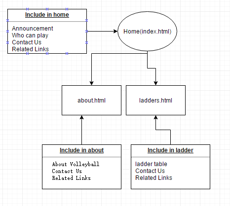

# Slammers
Slammers Beach Volleyball Looking for website

## Goals
The web site should produce an increase of Slammers'customers of at least 50%.

To achieve by using a good introducing about Slammers Beach Volleyball to appeal young customers.
## Success Evaluation
Success Evaluation will be measured by the numbers of of people signing up on the Slammers Beach Volleyball website.
And overall growth in the community and profit for the company.
## Target Audience
 The target Audience for the slammers Beach Volleyball website will be diverse capturing the attention of younger audience aged 15 - 30.
 As the young mans  who between 15 - 30 the sunshine and young community will be their target.
 The images of young people play beach volleyball is a key to get their attention. And the website should not have too much corner and square.
## Site Flowchart
   
## GitHub Repository
   This is my [GitHub Repository](https://github.com/Loseheartcrazy/Slammers "github").